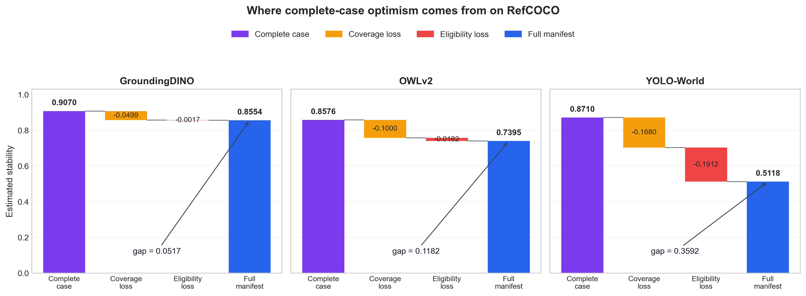
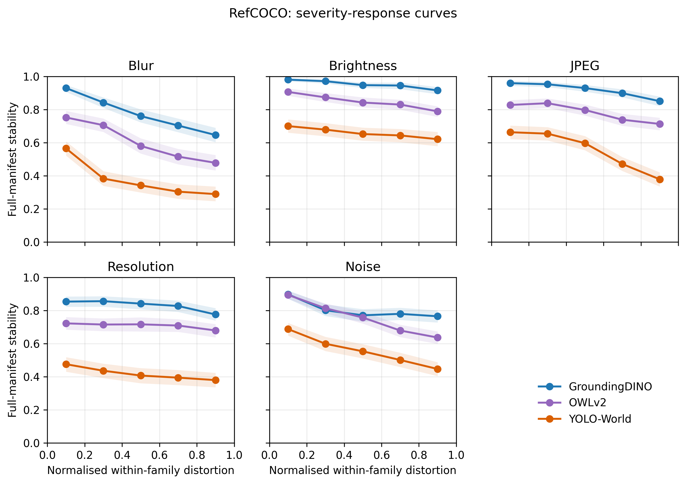

# Coverage-Aware Grounding Stability

[](https://github.com/HungChien/coverage-aware-grounding-stability/actions/workflows/ci.yml)


A model-agnostic benchmark for a practical question: when an image is mildly
corrupted, does the clean grounding winner remain observable and stay ahead of
its competitors?

The benchmark keeps candidate loss in the denominator. A trial fails when the
clean output has no usable competition, a tracked candidate disappears, a new
high-score candidate appears, or a competitor overtakes the clean winner. This
avoids the optimism introduced by analysing only candidates that survive.

The repository contains a reusable Python API, a JSONL command-line interface,
three reference model adapters, frozen experiment configurations, tests, and
the analysis outputs used by the research release. The public tree is limited
to benchmark software, protocols, manifests, and reproducibility evidence.

## Why coverage awareness matters

A survival-only score silently removes difficult trials. Suppose a clean image
has two candidates and both remain observable in 60 of 100 perturbations. If
the original winner stays first in 54 of those 60 trials, complete-case
persistence is `54 / 60 = 0.90`. The deployable event, however, succeeds in
only `54 / 100 = 0.54` trials. The other 40 trials are not missing statistical
data: candidate loss is itself an observed model failure.

The benchmark separates this difference into three quantities. For image-query
pair `i` and probe `j`, let:

- `G_i = 1` when the clean output is eligible for an order test;
- `C_ij = 1` when all tracked clean candidates remain covered;
- `S_ij = 1` when the clean winner remains first, conditional on coverage.

The corresponding population rates are

$$
\Gamma=\Pr(G=1),\qquad
\theta_{\mathrm{cov}}=\Pr(C=1\mid G=1),\qquad
\theta_{\mathrm{cc}}=\Pr(S=1\mid G=1,C=1).
$$

The full-manifest endpoint factors as

$$
\Theta=\Pr(GCS=1)
=\Gamma\,\theta_{\mathrm{cov}}\,\theta_{\mathrm{cc}}.
$$

`Theta` is full-manifest stability: every registered pair-probe slot remains
in the denominator, and an ineligible clean output or uncovered candidate
contributes zero. The exact optimism of reporting only surviving trials is

$$
\theta_{\mathrm{cc}}-\Theta
=\underbrace{\theta_{\mathrm{cc}}(1-\theta_{\mathrm{cov}})}_
{\text{coverage loss}}
+\underbrace{\theta_{\mathrm{cov}}\theta_{\mathrm{cc}}(1-\Gamma)}_
{\text{eligibility loss}}.
$$

This is an accounting identity, not a claim that the three mechanisms are
independent. Its practical value is diagnostic: it shows whether an apparently
high persistence score comes from stable ordering or from excluding outputs
for which ordering could not be checked.

## Main empirical findings

The reference study contains 2,500 image-query pairs, three models, and 80
independent reference probes per eligible pair. Full-manifest estimates and
pair-clustered 95% bootstrap intervals are:

| Dataset | Pairs | GroundingDINO | OWLv2 | YOLO-World |
|---|---:|---:|---:|---:|
| RefCOCO | 500 | 0.8554 [0.8383, 0.8723] | 0.7395 [0.7160, 0.7611] | 0.5118 [0.4790, 0.5438] |
| RefCOCO+ | 1,000 | 0.8512 [0.8389, 0.8632] | 0.7332 [0.7154, 0.7493] | 0.5018 [0.4798, 0.5245] |
| Ref-L4 | 1,000 | 0.8703 [0.8588, 0.8819] | 0.7677 [0.7523, 0.7830] | 0.5363 [0.5135, 0.5583] |

Point estimates are deterministic. Bootstrap confidence intervals are
resampled independently on each analysis run, so their boundaries may vary by
roughly `0.001` to `0.002` from the dissertation tables while leaving the
model ordering and conclusions unchanged.

Three patterns are consistent across the datasets:

1. GroundingDINO has the highest controlled stability, OWLv2 is second, and
   YOLO-World is third. These are benchmark comparisons under the frozen
   synthetic probe law, not universal architecture rankings.
2. Complete-case persistence materially overstates the full-manifest result.
   On RefCOCO, YOLO-World moves from 0.8710 on surviving trials to 0.5118 on
   the full manifest, an optimism gap of 0.3592. GroundingDINO's corresponding
   gap is 0.0517. Eligibility loss and coverage loss explain the difference.
3. Failures are not limited to rank reversals. Clean ineligibility, winner or
   competitor loss, and threatening candidate births are distinct observable
   outcomes. Their shares remain model-dependent on a common-eligibility
   subset, although these output symptoms do not identify internal neural
   mechanisms.



The exposure-cap audit also reran 38,679 selected cap-hit probes with a raw
candidate pool of 50. The full-manifest change was between 0 and 0.00145 in
all nine dataset-model groups, and the model ordering did not change. Severity
curves show a strong decline under blur, whereas brightness is flatter and
JPEG/noise responses vary more by model.



These findings concern candidate-order stability under the fixed synthetic
distribution `Q`. They do not establish semantic correctness or predict an
unspecified deployment distribution.

## Install

```bash
git clone https://github.com/HungChien/coverage-aware-grounding-stability.git
cd coverage-aware-grounding-stability
python -m venv .venv
```

Activate the environment, then install the core package:

```bash
python -m pip install --upgrade pip
python -m pip install -e .
```

For GroundingDINO, OWLv2, and YOLO-World inference:

```bash
python -m pip install -e ".[models]"
```

For trace-only statistical analysis without model frameworks:

```bash
python -m pip install -e ".[analysis]"
```

For development:

```bash
python -m pip install -e ".[dev]"
python -m pytest
```

## Evaluate your own model outputs

The fastest integration path does not require a model adapter. Export each
clean/perturbed candidate pair as JSON or JSONL:

```json
{
  "id": "sample-001",
  "clean_candidates": [
    {"box": [0, 0, 10, 10], "score": 0.90},
    {"box": [20, 0, 30, 10], "score": 0.70}
  ],
  "perturbed_candidates": [
    {"box": [1, 0, 11, 10], "score": 0.85},
    {"box": [20, 1, 30, 11], "score": 0.65}
  ]
}
```

Run the common output contract:

```bash
cags evaluate \
  --input examples/candidate_pairs.jsonl \
  --output outcomes.jsonl \
  --config config/operational_benchmark_v1.json
```

Boxes use `xyxy` image coordinates. Scores only need to preserve the model's
native candidate order; scores are never compared across models.

### Python API

```python
from coverage_aware_grounding_stability import (
    BenchmarkEvaluator,
    Candidate,
    OutputContract,
)

clean = [
    Candidate((0, 0, 10, 10), 0.90),
    Candidate((20, 0, 30, 10), 0.70),
]
perturbed = [
    Candidate((1, 0, 11, 10), 0.85),
    Candidate((20, 1, 30, 11), 0.65),
]

evaluator = BenchmarkEvaluator(OutputContract())
result = evaluator.evaluate(clean, perturbed)
print(result.to_dict())
```

To run inference inside the benchmark, implement `GroundingAdapter.predict`.
The minimal template is in
[`examples/custom_adapter.py`](examples/custom_adapter.py). Built-in adapters
for GroundingDINO, OWLv2, and YOLO-World are in
[`src/coverage_aware_grounding_stability/adapters.py`](src/coverage_aware_grounding_stability/adapters.py).

## What is measured

The default output contract tracks five spatially distinct clean candidates
and exposes twenty perturbed candidates. Hungarian maximum-IoU assignment
associates candidates one-to-one.

A clean/perturbed pair receives one of five observable outcomes:

| Outcome | Meaning |
|---|---|
| `stable` | all tracked candidates remain covered and the winner stays first |
| `winner_missing` | the clean winner cannot be associated |
| `competitor_missing` | at least one tracked competitor cannot be associated |
| `threatening_birth` | an unmatched, spatially novel candidate threatens the winner |
| `ranking_reversal` | coverage holds but a competitor overtakes the winner |

Clean outputs with fewer than two spatially distinct candidates are marked
ineligible and contribute zero to full-manifest stability. If `C` denotes
coverage and `S` strict order preservation, the per-probe endpoint is
`Y = C × S`. The main estimate is the manifest mean of `Y`, including clean
ineligibility.

The exact rules are implemented in
[`operational_stability.py`](src/coverage_aware_grounding_stability/operational_stability.py)
and recorded in
[`output_contract_preregistration_v2.freeze.json`](config/output_contract_preregistration_v2.freeze.json).

## Reference experiment protocol

The frozen release evaluates three candidate-producing models:

- GroundingDINO Tiny;
- OWLv2 Base Patch16 Ensemble at pinned revision
  `cfd3195ba4ea9592eec887ded089f4c08eff231d`;
- YOLO-World v2 Small.

Every eligible image-query pair receives 40 diagnostic probes and an
independent 80-probe reference. The probe law balances blur, brightness, JPEG,
resolution, and Gaussian noise. It is a controlled synthetic design
distribution, not an estimate of any particular deployment environment. The
resulting estimates and intervals are reported in
[Main empirical findings](#main-empirical-findings).

## What evidence is retained

A normal GitHub clone contains the compact evidence needed to inspect every
reported result: per-sample summaries, aggregate CSV tables, 2,000-resample
bootstrap outputs, figures, run metadata, validation audits, and artifact
hashes. The following map links the main claims to both their evidence and the
script that regenerates it from traces:

| Claim or check | Tracked evidence | Rebuild script |
|---|---|---|
| full-manifest estimates and failure modes | [RefCOCO](results/operational_benchmark_v1/analysis/reference_aggregate_estimands.csv), [RefCOCO+](results/operational_transfer_refcocoplus_v1/analysis/reference_aggregate_estimands.csv), [Ref-L4](results/operational_transfer_refl4_v1/analysis/reference_aggregate_estimands.csv) | [analyse_operational_benchmark.py](scripts/analyse_operational_benchmark.py) |
| complete-case optimism and decomposition | [aggregate_optimism_bootstrap.csv](results/complete_case_optimism_analysis/aggregate_optimism_bootstrap.csv) | [analyse_complete_case_optimism.py](scripts/analyse_complete_case_optimism.py) |
| finite-probe variance and allocation | [variance_component_estimates.csv](results/two_stage_sampling_analysis/variance_component_estimates.csv) | [analyse_two_stage_sampling.py](scripts/analyse_two_stage_sampling.py) |
| common eligibility, cap bounds, severity and family weights | [reviewer-risk report](results/reviewer_risk_controls/reviewer_risk_controls_report.md) | [analyse_reviewer_risk_controls.py](scripts/analyse_reviewer_risk_controls.py) |
| raw-pool-50 cap confirmation | [cap50_stability_summary.csv](results/cap50_confirmatory/summary/cap50_stability_summary.csv) | [summarise_cap50_confirmatory.py](scripts/summarise_cap50_confirmatory.py) |
| output-contract sensitivity | [output-contract report](results/output_contract_robustness/output_contract_robustness_report.md) | [analyse_output_contract_robustness.py](scripts/analyse_output_contract_robustness.py) |

The full per-probe `sample_traces.jsonl.gz` files, source images, and model
weights are present on the prepared local machine but are deliberately not
committed: the traces are large, while datasets and checkpoints retain their
upstream licences. `LOCAL_ASSET_MANIFEST.json` records their expected paths,
byte sizes, and SHA-256 hashes. Consequently, a clone is sufficient to audit
the reported tables and provenance; exact trace-level regeneration additionally
requires the separately retained traces, or a fresh inference run from the
frozen manifests and configurations.

## Reproduce the release

### 1. Prepare data and model checkpoints

Raw images, licensed annotations, model weights, Hugging Face caches, and full
candidate traces are intentionally excluded from Git. The tracked manifests
fix the exact image-query pairs:

| Dataset | Manifest | Rows |
|---|---|---:|
| RefCOCO | `data_operational/refcoco_unseen500/manifest.json` | 500 |
| RefCOCO+ | `data_operational/refcocoplus_transfer1000/manifest.json` | 1,000 |
| Ref-L4 | `data_operational/refl4_transfer1000/manifest.json` | 1,000 |

Place images at the relative paths stored in each manifest. Ref-L4 follows the
upstream CC BY-NC 4.0 release; COCO/RefCOCO assets retain their upstream
licences. The preparation scripts can rebuild the manifests from legally
obtained source datasets:

```bash
python scripts/prepare_operational_manifest.py --help
python scripts/prepare_refcocoplus_transfer_manifest.py --help
python scripts/prepare_refl4_transfer_manifest.py --help
```

The inference adapters use local checkpoints and set the Transformers stack to
offline mode during a run. Download the configured checkpoints before starting
the benchmark. `scripts/cache_owlv2_checkpoint.py` verifies the pinned OWLv2
checkpoint.

### 2. Run or resume inference

Each command checkpoints after every sample. Re-running with `--resume` skips
only samples that have both a summary row and a complete trace.

```bash
python scripts/run_operational_benchmark.py \
  --config config/operational_benchmark_owlv2_control_v1.json \
  --model groundingdino \
  --output-root results/operational_benchmark_v1 \
  --resume
```

Replace the config, model, and result root using this matrix:

| Dataset | Three-model config | Result root |
|---|---|---|
| RefCOCO | `config/operational_benchmark_owlv2_control_v1.json` | `results/operational_benchmark_v1` |
| RefCOCO+ | `config/operational_transfer_refcocoplus_owlv2_control_v1.json` | `results/operational_transfer_refcocoplus_v1` |
| Ref-L4 | `config/operational_transfer_refl4_owlv2_control_v1.json` | `results/operational_transfer_refl4_v1` |

On Windows, the PowerShell pipelines run validation, analysis, figures, and
artifact hashing after inference:

```powershell
powershell -ExecutionPolicy Bypass -File scripts\run_owlv2_control_pipeline.ps1
```

### 3. Rebuild final analyses from traces

```bash
python scripts/analyse_complete_case_optimism.py
python scripts/analyse_two_stage_sampling.py
python scripts/analyse_reference_80_adequacy.py
python scripts/analyse_output_contract_robustness.py
python scripts/analyse_reviewer_risk_controls.py
python scripts/summarise_cap50_confirmatory.py
```

The cap-50 confirmation re-infers only reference probes whose saved perturbed
pool reached the exposure cap:

```powershell
powershell -ExecutionPolicy Bypass -File scripts\run_cap50_confirmatory_pipeline.ps1
```

### 4. Verify artifacts

```bash
python scripts/validate_operational_artifacts.py \
  --config config/operational_benchmark_owlv2_control_v1.json \
  --result-root results/operational_benchmark_v1
python -m pytest
```

Analysis directories contain `analysis_audit.json` and/or
`artifact_manifest.json` files with input hashes, row counts, seeds, and
algebraic residual checks. See [`REPRODUCIBILITY.md`](REPRODUCIBILITY.md) for
the retained artifact map and integrity commands. Git-ignored trace and image
assets are covered by [`LOCAL_ASSET_MANIFEST.json`](LOCAL_ASSET_MANIFEST.json).

## Repository layout

```text
config/                 frozen benchmark and probe configurations
data_operational/       tracked manifests; local images are ignored by Git
docs/methodology/       estimands, trace schema, and preregistered protocols
examples/               custom-adapter and JSONL integration examples
results/                final summaries, audits, figures, and local traces
scripts/                data, inference, validation, and analysis entry points
src/coverage_aware_grounding_stability/
                        installable API and built-in adapters
tests/                  unit, identity, estimator, and public-API tests
```

Development-only dry runs, smoke tests, OOM reproductions, document renders,
and progress presentations are not part of the public tree.

## Result directories

- `operational_benchmark_v1`, `operational_transfer_refcocoplus_v1`, and
  `operational_transfer_refl4_v1`: primary summaries and trace-derived figures;
- `complete_case_optimism_analysis`: conditioning-gap and correctness-stratum
  audits;
- `two_stage_sampling_analysis`: image/probe variance decomposition;
- `reference_80_adequacy`: reference-depth checks;
- `output_contract_robustness`: 108-contract sensitivity grid;
- `reviewer_risk_controls`: cap bounds, common eligibility, severity curves,
  family-weight endpoints, and clustered intervals;
- `cap50_confirmatory`: wider-candidate-pool confirmation.

## Contributing and citation

See [`CONTRIBUTING.md`](CONTRIBUTING.md) before adding a model, dataset, probe
family, or output contract. Cite the software metadata in
[`CITATION.cff`](CITATION.cff).

## License

The software in this repository is released under the MIT License. See
[`LICENSE`](LICENSE). Dataset annotations, source images, model weights, and
third-party checkpoints remain under their own upstream licences.
