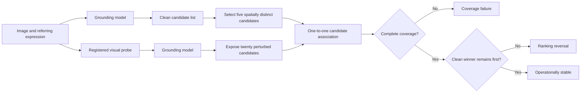
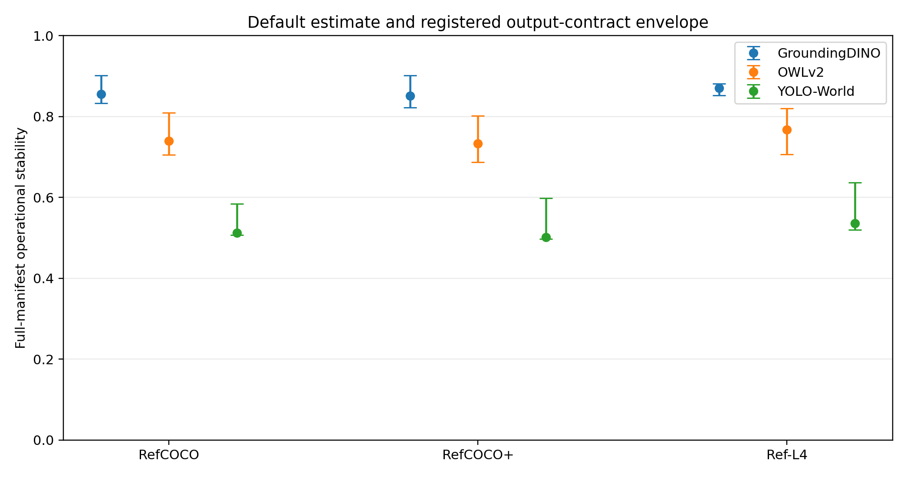
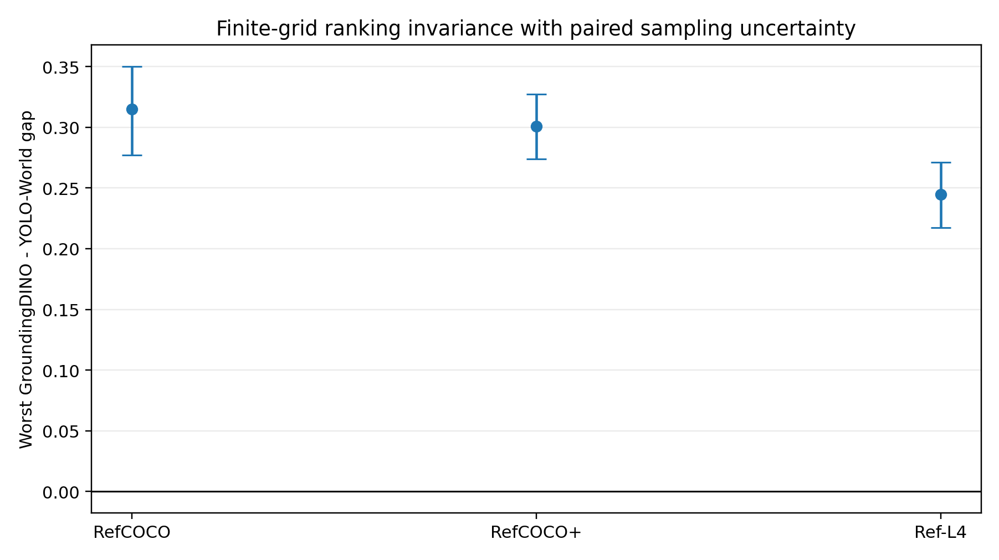
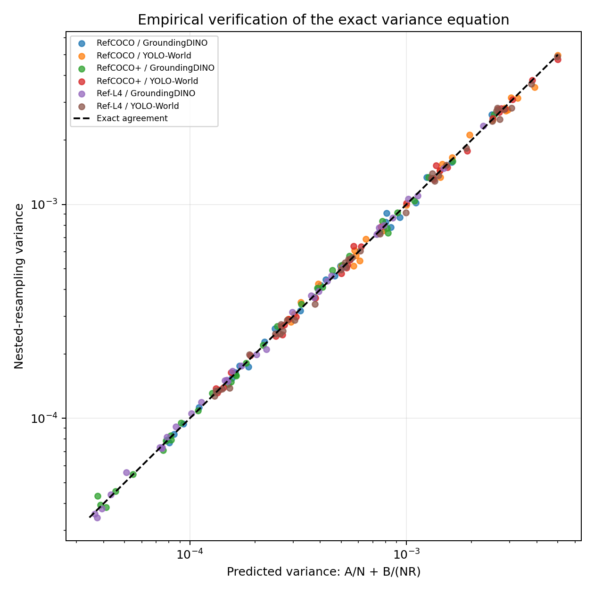
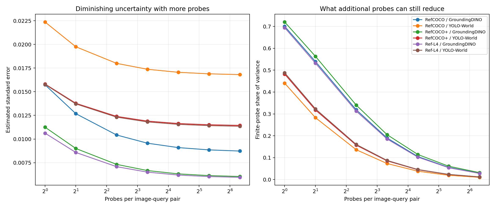
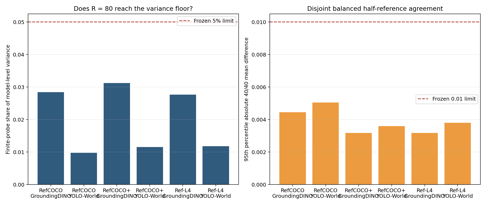
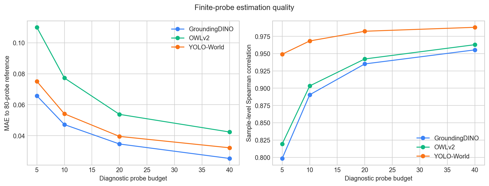
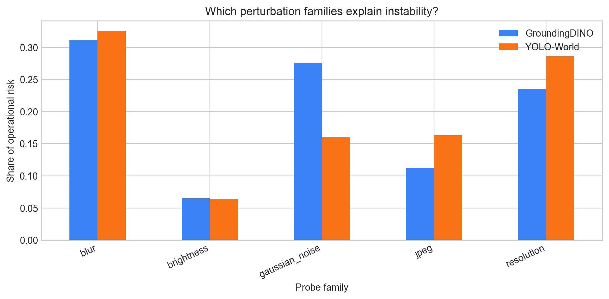
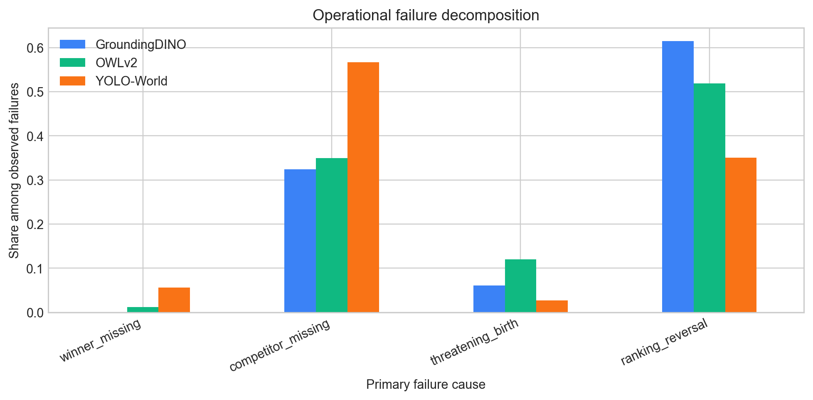

# Coverage-Aware Grounding Stability

[](https://github.com/HungChien/coverage-aware-grounding-stability/actions/workflows/ci.yml)


This repository contains an MSc dissertation benchmark for analysing the
operational stability of candidate-producing vision-language grounding models.
The contribution is a reproducible, coverage-aware framework that asks:

> When a grounding model is queried with an image and referring expression,
> does its clean winner remain observable and remain ahead of its competitors
> under a registered distribution of meaning-preserving probes?

The framework is evaluated on GroundingDINO and YOLO-World using 500 RefCOCO,
1,000 RefCOCO+, and 1,000 Ref-L4 image-query pairs. It records complete
candidate-level traces, finite-probe uncertainty, failure causes,
perturbation-family risk, and cross-model results.

The formatted MSc dissertation is available as
[`reports/dissertation/submission/Yukun_Shi_3150784S_MSc_Dissertation.pdf`](reports/dissertation/submission/Yukun_Shi_3150784S_MSc_Dissertation.pdf).

## Installation

Create an isolated environment and install the package:

```bash
python -m venv .venv
# Windows: .venv\Scripts\activate
# Linux/macOS: source .venv/bin/activate
python -m pip install --upgrade pip
python -m pip install -e ".[dev]"
```

Install the optional inference stack only on machines that will run the two
grounding models:

```bash
python -m pip install -e ".[models]"
```

Model checkpoints and datasets are intentionally not distributed in Git. Use
the preparation scripts in `scripts/` and update only local paths in the JSON
configuration files. Frozen scientific parameters must not be edited in place.

## Research Scope

The primary object is **candidate-order stability**, not semantic correctness.

| Question | Quantity | Role |
|---|---|---|
| Does the clean output expose a meaningful candidate competition? | Clean eligibility | Reported for the full manifest |
| Can the tracked candidates still be associated after a probe? | Candidate coverage | Secondary diagnostic |
| Does the clean winner remain first after successful association? | Conditional ranking stability | Secondary diagnostic |
| Are both coverage and ranking preserved? | Operational stability | Primary estimand |
| Did the clean winner match the annotation? | Ground-truth IoU | Context only, not the stability target |

A prediction can be stable and wrong. The benchmark never equates stability
with correctness.

## Common Output Contract

A candidate-producing grounding model is represented as

```math
\mathcal O_m(I,T)=\{(B_i,s_i)\}_{i=1}^{K},
\qquad s_1\geq s_2\geq\cdots\geq s_K,
```

where `I` is an image, `T` is a referring expression, `B_i` is a candidate
box, and `s_i` is the model-specific matching score.

The implementation freezes two candidate counts:

- `K_t = 5` spatially distinct clean candidates are tracked;
- `K_e = 20` perturbed candidates are exposed.

The wider perturbed output prevents a newly born high-score candidate from
being silently hidden by a narrow top-five list.

All five numeric parameters and all fixed decision rules are defined in the
machine-readable preregistration
[`config/output_contract_preregistration_v2.json`](config/output_contract_preregistration_v2.json).
The preregistration, 108-setting analysis grid, implementation, and tests were
hashed before the enhanced replay in
[`config/output_contract_preregistration_v2.freeze.json`](config/output_contract_preregistration_v2.freeze.json).



## Mathematical Definition

Let `U` be a random probe drawn from the preregistered distribution `Q`.
Hungarian maximum-IoU matching produces a one-to-one association `pi_U` from
clean candidates to perturbed candidates.

Coverage is one only when every tracked candidate is associated and no
unmatched spatially novel candidate threatens the matched clean winner:

```math
C(U)\in\{0,1\}.
```

When coverage holds, the perturbed candidate-gap vector is

```math
\mathbf G(U)=
\begin{bmatrix}
s'_{\pi_U(1)}-s'_{\pi_U(2)}\\
\vdots\\
s'_{\pi_U(1)}-s'_{\pi_U(K_t)}
\end{bmatrix}.
```

Conditional ranking stability and operational stability are

```math
S(U)=\mathbb 1\{\min_jG_j(U)>0\},
\qquad
Y(U)=C(U)S(U).
```

The benchmark estimates

```math
\theta_{\mathrm{cov}}=\Pr(C=1),
\qquad
\theta_{\mathrm{rank}}=\Pr(S=1\mid C=1),
```

and the primary estimand

```math
\theta_{\mathrm{op}}
=\Pr(Y=1)
=\theta_{\mathrm{cov}}\theta_{\mathrm{rank}}.
```

## Why Coverage Is Necessary

The operational risk has the exact decomposition

```math
1-\theta_{\mathrm{op}}
=(1-\theta_{\mathrm{cov}})
+\theta_{\mathrm{cov}}(1-\theta_{\mathrm{rank}}).
```

Direct persistence computed only on successfully matched candidates can be
optimistic. Its exact excess over operational stability is

```math
\theta_{\mathrm{rank}}-\theta_{\mathrm{op}}
=\theta_{\mathrm{rank}}(1-\theta_{\mathrm{cov}}).
```

The difference is non-zero whenever candidate coverage is imperfect and some
covered probes preserve the ranking. Candidate disappearance and threatening
candidate birth are therefore part of the estimand, not preprocessing errors.

## Finite-Probe Estimation

For a fixed sample, registered probes produce Bernoulli outcomes

```math
Y_1,\ldots,Y_n\overset{\mathrm{iid}}{\sim}
\mathrm{Bernoulli}(\theta_{\mathrm{op}}).
```

The sample estimator is

```math
\widehat\theta_{\mathrm{op}}=\frac{1}{n}\sum_{r=1}^{n}Y_r,
```

with variance

```math
\mathrm{Var}(\widehat\theta_{\mathrm{op}})
=\frac{\theta_{\mathrm{op}}(1-\theta_{\mathrm{op}})}{n}
\leq\frac{1}{4n}.
```

Exact 95% Clopper-Pearson intervals are reported at diagnostic budgets 5, 10,
20, and 40. An independent 80-probe estimate is used as a higher-budget finite
reference. It is not described as an exact population probability.

## Cross-Architecture Comparability

The benchmark compares observable Bernoulli events rather than raw scores.
For any strictly increasing model-specific score transformation `h_m`,

```math
s_i>s_j \Longleftrightarrow h_m(s_i)>h_m(s_j).
```

Candidate-order events are therefore invariant to monotone score rescaling,
conditional on the exposed candidate set. This permits GroundingDINO and
YOLO-World to share the same estimand without claiming that their numerical
confidence scales are calibrated to each other.

## Output-Contract Robustness

An output contract defines the measurement operation, so absolute stability
must be accompanied by contract sensitivity. The registered finite grid
contains 108 combinations of:

- tracked clean candidates: 2, 3, 4, or 5;
- exposed perturbed candidates: 10, 15, or 20;
- association IoU: 0.10, 0.15, or 0.25;
- birth-novelty IoU: 0.50, 0.70, or 0.85.

Duplicate suppression is held at 0.70 because the v1 perturbed traces were
already deduplicated at that threshold. Clean eligibility is audited over
duplicate thresholds 0.50 to 0.85, but this partial analysis is not presented
as full operational sensitivity.

For models `a` and `b`, finite-grid ranking invariance is established when

```math
\min_{\lambda\in\Lambda}
\left[\widehat\Theta_a(\lambda)-\widehat\Theta_b(\lambda)\right]>0.
```

GroundingDINO remains above YOLO-World at every registered identical setting
on all three datasets. The minimum same-contract gaps are 0.3147 on RefCOCO,
0.3009 on RefCOCO+, and 0.2448 on Ref-L4. Paired 2,000-repetition bootstrap
95% lower bounds are 0.2772, 0.2738, and 0.2173, respectively. The stronger
condition—minimum GroundingDINO stability exceeding maximum YOLO-World
stability—also holds on every dataset.

Absolute values remain contract dependent. The registered envelope widths
range from 0.0287 to 0.1163, so the default estimate is always reported with
its full sensitivity interval rather than as a contract-free quantity.





The complete mathematical argument, engineering interpretation, and evidence
are in
[`docs/methodology/output_contract_parameter_theory.md`](docs/methodology/output_contract_parameter_theory.md)
and
[`results/output_contract_robustness/output_contract_robustness_report.md`](results/output_contract_robustness/output_contract_robustness_report.md).

The runner now supports a larger raw candidate pool and stores both pre- and
post-contract perturbed candidates. Future confirmatory runs use a raw pool of
50, making duplicate suppression and exposure above 20 replayable without new
model inference.

## Model-Level Estimation from Finite Images and Probes

The single-sample probe mean is extended to a two-stage model-level estimator.
Let `X ~ P` be an image-query pair, `U ~ Q` a registered probe, and `W_m(X,U)`
the full-manifest operational success event, including clean eligibility. The
target is

```math
\Theta_{m,P,Q}=\mathbb E_X\mathbb E_U[W_m(X,U)].
```

For `N` independently sampled pairs and `R` conditionally independent probes
per pair,

```math
\widehat\Theta_m
=\frac{1}{NR}\sum_{n=1}^{N}\sum_{r=1}^{R}W_{mnr}.
```

The estimator is unbiased and has the exact variance decomposition

```math
\mathrm{Var}(\widehat\Theta_m)
=\frac{A_m}{N}+\frac{B_m}{NR},
```

where `A_m` is between-pair stability heterogeneity and `B_m` is within-pair
probe uncertainty. This proves that increasing the number of pairs reduces
both uncertainty sources, whereas increasing probes only reduces the second.
It also yields a design effect, an effective independent sample size, a target
sample-size equation, and the cost-optimal allocation

```math
R_{\mathrm{opt}}=\sqrt{\frac{B_m c_X}{A_m c_U}}.
```

The theory and proofs are in
[`docs/methodology/two_stage_model_stability_theory.md`](docs/methodology/two_stage_model_stability_theory.md).
The frozen three-dataset, two-model analysis is in
[`results/two_stage_sampling_analysis/`](results/two_stage_sampling_analysis/).





## Adequacy of the 80-Probe Reference

The frozen reference depth was audited separately from the small-probe
estimators. Model-level adequacy requires the finite-probe component to account
for no more than 5% of total model-level variance and the 95th percentile
absolute discrepancy between family-balanced, disjoint 40/40 half-reference
means to remain below 0.01.

All six dataset-model groups satisfy both criteria. The 80-probe reference is
therefore sufficiently deep for model-level comparison under the registered
probe law. It remains a finite, noisy target at the individual-sample level and
is never described as exact ground truth.



The complete protocol and results are available in
[`docs/methodology/reference_80_adequacy_protocol.md`](docs/methodology/reference_80_adequacy_protocol.md)
and
[`results/reference_80_adequacy/reference_80_adequacy_report.md`](results/reference_80_adequacy/reference_80_adequacy_report.md).

## Failure Localisation

Every failed probe receives one primary label:

1. `winner_missing` — the clean winner cannot be associated;
2. `competitor_missing` — a tracked competitor cannot be associated;
3. `threatening_birth` — a novel unmatched candidate threatens the winner;
4. `ranking_reversal` — coverage holds but a competitor overtakes the winner.

For a ranking reversal, the culprit competitor is the candidate with the
smallest perturbed winner-to-competitor gap. This turns a model-level stability
number into an auditable engineering profile.

For probe families `f` with preregistered mixture weights `pi_f`, operational
risk decomposes as

```math
1-\theta_{\mathrm{op}}
=\sum_f\pi_f(1-\theta_f).
```

The resulting shares describe where instability is observed under the
registered probe distribution. They are descriptive, not causal claims.

## Frozen Large-Scale Experiment

| Component | Frozen setting |
|---|---|
| Dataset | 500 unique RefCOCO image-query pairs |
| Development-set overlap | Zero images |
| Models | GroundingDINO Tiny; YOLO-World v2 Small |
| Probe families | Blur, brightness, JPEG, resolution, Gaussian noise |
| Diagnostic probes | 40 per eligible model-sample pair |
| Independent reference probes | 80 per eligible model-sample pair |
| Reported budgets | 5, 10, 20, 40 balanced probes |
| Confidence intervals | Exact 95% Clopper-Pearson |
| Bootstrap | 2,000 paired hierarchical repetitions |
| Saved trace | Clean output plus every candidate association and probe outcome |

The main hypotheses are:

- finite-budget estimates approach the independent reference as budget grows;
- coverage-aware stability differs measurably from conditional persistence;
- the output contract transfers unchanged across both model architectures;
- failure and perturbation-family profiles identify model-specific instability;
- all figures can be reproduced from complete saved traces.

## Result Artifacts

Formal results are written to `results/operational_benchmark_v1/`.

After both model runs complete, the analysis pipeline generates:







The tables and English report are stored beside these figures. During a formal
run, `progress.json` records the exact completed count and elapsed time.

## Reproduction

Run all tests, both model benchmarks, and the final analysis sequentially:

```powershell
powershell -ExecutionPolicy Bypass -File scripts\run_frozen_operational_pipeline.ps1
```

Check progress without modifying the experiment:

```powershell
python scripts\check_operational_progress.py
```

Run one model with safe per-sample resume:

```powershell
python scripts\run_operational_benchmark.py `
  --model groundingdino `
  --output-root results\operational_benchmark_v1 `
  --resume
```

Regenerate statistics and figures from completed traces:

```powershell
python scripts\analyse_operational_benchmark.py
```

## Quick Verification

```powershell
python -m pytest tests -q
```

All repository tests should pass without requiring model weights or datasets.

## Repository Structure

```text
coverage-aware-grounding-stability/
  .github/          Continuous-integration workflow
  config/           Frozen benchmark, transfer, probe, and contract configurations
  data_operational/ Local datasets plus trackable manifests; raw assets are ignored
  docs/             Current theory, preregistrations, execution logs, and findings
  paper/            Literature audit, claims matrix, and mathematical source
  reports/          Final dissertation and reproducible document source
  results/          Compact canonical tables, figures, hashes, and English reports
  scripts/          Data preparation, frozen inference, analysis, and validation tools
  src/              Candidate contract, association, probes, and statistical estimators
  tests/            Dataset-independent mathematical and implementation tests
```

## Contribution Boundary

The framework supports claims about stability under a specified probe
distribution. It does not prove semantic correctness, robustness to every
possible real-world shift, or causal responsibility of a corruption family.
Its intended contribution is a mathematically explicit, coverage-aware,
finite-sample and cross-architecture benchmark for candidate-order stability.

## Reproducibility policy

- Frozen configurations and their hashes define confirmatory runs.
- Each transfer freeze records the exact Git commit used for inference. Later
  registered analysis improvements remain on `main`; checkout the recorded
  commit when a byte-for-byte replay of an earlier run is required.
- Complete traces stay local because of size; compact summaries, figures, and
  artifact manifests are versioned.
- Every reported result names the dataset split, model checkpoint, output
  contract, probe law, and analysis entry point.
- Failed runs and prototype experiments are not part of the release surface.

See [`MANIFEST.json`](MANIFEST.json) for the canonical release artifacts and
[`CONTRIBUTING.md`](CONTRIBUTING.md) for extension rules.
