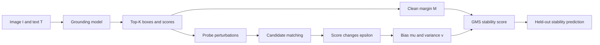

# GMS Reliability for Vision-Language Grounding

This repository contains the current MSc dissertation prototype for analysing
the reliability of vision-language grounding models at the output-decision
level.

The central question is:

> When a grounding model selects a candidate region for a text query, can we
> estimate whether this candidate-order decision will remain stable under
> small visual or textual perturbations?

The project does not propose a new detector. Instead, it studies whether the
existing candidate boxes and scores produced by models such as GroundingDINO
and YOLO-World can be used to diagnose local decision stability.

## Current Thesis Claim

The current evidence supports the following claim:

> Perturbation-aware candidate-order geometry predicts held-out ranking
> stability better than the clean score margin alone.

This means that a prediction should not be judged only by the clean top-1
minus top-2 score gap. The way this gap changes under controlled perturbations
also contains useful reliability information.

## Why This Matters

Vision-language grounding models are increasingly used in open-vocabulary
perception, robotics, UAV perception and human-in-the-loop visual search. In
these settings, the model may give a plausible box and a high score, but the
decision can still be fragile.

This project separates two questions that are often mixed together:

| Question | What it means | How this project treats it |
|---|---|---|
| Semantic correctness | Did the model localise the intended object? | Evaluated with annotations when available |
| Candidate-order stability | Does the top candidate remain ahead of competitors under perturbation? | Modelled by GMS |

GMS is therefore a deployment-risk or stability indicator. It is not an exact
probability of semantic correctness.

## Core Idea

Most grounding and open-vocabulary detection models can be represented through
a common output interface:

```math
\mathcal{O}_m(I,T)=\{(B_i,s_i)\}_{i=1}^{K}
```

where:

- `I` is the image.
- `T` is the text query.
- `B_i` is candidate box `i`.
- `s_i` is its matching score.
- `K` is the number of retained candidates.

For analysis, this becomes an output matrix:

```math
\mathbf{O}_m(I,T)=
\begin{bmatrix}
x_1^{min} & y_1^{min} & x_1^{max} & y_1^{max} & s_1 \\
x_2^{min} & y_2^{min} & x_2^{max} & y_2^{max} & s_2 \\
\cdots & \cdots & \cdots & \cdots & \cdots \\
x_K^{min} & y_K^{min} & x_K^{max} & y_K^{max} & s_K
\end{bmatrix}
```

This output-level abstraction allows different models to be compared even when
their internal architectures are different.

## Theoretical Formulation

Let candidate 1 be the clean top prediction and candidate `j` be a competing
candidate. The clean margin is:

```math
M_j=s_1-s_j
```

After perturbation, each score receives an error term:

```math
s_1' = s_1 + \epsilon_1,\qquad
s_j' = s_j + \epsilon_j
```

A ranking reversal occurs when the competitor becomes equal to or larger than
the original top candidate:

```math
s_j+\epsilon_j \geq s_1+\epsilon_1
```

Rearranging gives:

```math
Z_j = \epsilon_j-\epsilon_1,\qquad
\text{failure occurs when } Z_j \geq M_j
```

So `Z_j` measures how much the perturbation favours the competitor over the
clean top prediction.

## From Failure Probability To GMS

Let:

```math
\mu_j=\mathbb{E}[Z_j],\qquad v_j=\mathrm{Var}(Z_j)
```

Define the effective margin:

```math
\Delta_j=[M_j-\mu_j]_+
```

where `[x]_+ = max(x, 0)`. If `mu_j >= M_j`, the average perturbation bias has
already removed the clean score advantage, so the decision is treated as
high-risk.

Using Cantelli's inequality:

```math
\mathbb{P}(Z_j \geq M_j)
\leq
\frac{v_j}{v_j+\Delta_j^2}
```

The component stability score is defined as the complement of this upper bound:

```math
R_j
:=
1-\frac{v_j}{v_j+\Delta_j^2}
=
\frac{\Delta_j^2}{\Delta_j^2+v_j}
```

For top-K candidates, each competitor has its own `R_j`. The global GMS score
uses the weakest competitor boundary:

```math
R_{GMS}=\min_{j>1} R_j
```

This gives a conservative, bound-derived stability score for the most dangerous
candidate-order boundary.

## Why This Is More Than Margin

Clean margin only measures the distance to the current ranking boundary:

```math
M_j=s_1-s_j
```

GMS also includes:

- perturbation bias: `mu_j`
- perturbation variance: `v_j`
- the most dangerous competitor among top-K

This means two predictions with the same clean margin can receive different GMS
scores if their local perturbation behaviour is different.



## Visual Summary

### GroundingDINO


### YOLO-World


### Candidate Matching Audit

The method depends on tracking candidate identities under perturbation. The
matching audit checks whether the same clean candidate is consistently matched
after perturbation.


## Experimental Protocol

The current validation uses a RefCOCO-style setup with image-text pairs and a
fixed perturbation family.

| Component | Current setting |
|---|---|
| Models | GroundingDINO and YOLO-World |
| Samples | 100 GroundingDINO samples, 74 YOLO-World valid samples |
| Clean candidates | Raw top-20 candidates |
| Geometry candidates | Up to 5 spatially distinct candidates |
| Probe perturbations | 12 perturbations for moment estimation |
| Held-out perturbations | 11 unseen perturbations for evaluation |
| Target | Candidate-order stability, not semantic correctness |

The held-out perturbations are not used to compute GMS. They are used only to
test whether GMS predicts unseen stability.

## Key Results

### Held-Out Candidate-Order Stability

| Model | Clean margin AUROC | Full GMS AUROC | Improvement |
|---|---:|---:|---:|
| GroundingDINO | 0.562 | 0.697 | +0.133 |
| YOLO-World | 0.708 | 0.771 | +0.063 |

Bootstrap intervals:

| Model | Mean AUROC improvement | 95 percent interval |
|---|---:|---:|
| GroundingDINO | +0.133 | [0.076, 0.197] |
| YOLO-World | +0.063 | [0.002, 0.127] |

### Interpretation

The main supported finding is:

> Local perturbation moments provide information beyond the clean score margin.

The current experiments do not support stronger claims such as:

- GMS is a correctness probability.
- Full top-K is always significantly better than top-2.
- Explicit covariance always improves the score.
- The plug-in Cantelli score is a finite-sample certificate.

## Completed Work

- Formalised a model-agnostic output interface for grounding models.
- Defined ranking reversal as the core failure event.
- Derived the GMS score from a one-sided probability bound.
- Implemented candidate matching under visual and prompt perturbations.
- Built a full top-K candidate trajectory pipeline.
- Evaluated GroundingDINO and YOLO-World.
- Ran matching audits, probe-budget analysis and bootstrap analysis.
- Generated supervisor-ready presentation material.

## Current Repository Layout

```text
gms_reliability/
  src/              Core reliability, geometry and perturbation code
  scripts/          Experiment, evaluation and figure generation scripts
  tests/            Mathematical and implementation tests
  docs/             English methodology and result reports
  paper/            Theory notes and literature matrix
  results/          Compact experiment outputs and figures
  reports/          Presentation artifacts
  data/             Lightweight split metadata only
  config/           Configuration files
```

Chinese and bilingual notes are intentionally kept outside this repository in
`../doc/` so that the engineering repository remains English-only.

## Quick Verification

```powershell
python -m pytest tests -q
```

Expected result:

```text
8 passed
```

## Reproducing The Main Pipeline

Large model weights and raw COCO annotations are not committed. Place them
locally before running the full pipeline.

```powershell
python scripts/run_full_geometry_experiment.py --model groundingdino --limit 100 --tag full100
python scripts/evaluate_full_geometry.py --input outputs_refcoco/full_geometry/groundingdino_full100

python scripts/run_full_geometry_experiment.py --model yoloworld --limit 100 --tag full100
python scripts/evaluate_full_geometry.py --input outputs_refcoco/full_geometry/yoloworld_full100

python scripts/compare_models.py --groundingdino outputs_refcoco/full_geometry/groundingdino_full100 --yoloworld outputs_refcoco/full_geometry/yoloworld_full100
```

## Planned Next Steps

### Short Term

- Improve probe selection from a fixed set to a designed diagnostic set.
- Separate candidate coverage failure from conditional ranking instability.
- Use independent calibration and evaluation splits at image level.
- Add diagnostic variables to explain why a prediction is unstable.
- Compare GMS against confidence calibration, entropy and prompt consistency.

### Medium Term

- Test larger RefCOCO / RefCOCO+ splits.
- Add OWL-ViT or another grounding model for broader architecture coverage.
- Study whether instability modes transfer across models.
- Introduce finite-sample calibration rather than relying only on plug-in moments.
- Convert the methodology into a dissertation chapter draft.

### Dissertation-Level Goal

The intended final contribution is a model-agnostic framework for analysing
candidate-order stability in vision-language grounding. The framework should be
useful both theoretically, through a clear ranking-reversal formulation, and
practically, by helping engineers identify fragile grounding decisions before
they are used in downstream systems.

## Important Limitation

A stable prediction can still be wrong. GMS measures whether the model's own
candidate ordering is stable under a registered perturbation family. Semantic
correctness must be evaluated separately using ground-truth annotations or
other semantic evidence.
